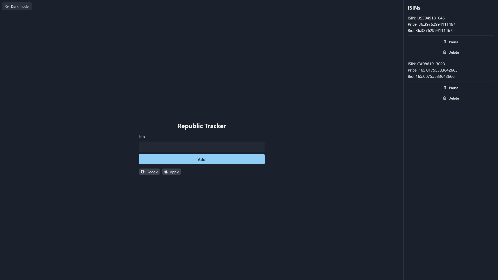

# republic

[](https://cypress.io)
[](https://github.com/prettier/prettier)
[](https://github.com/malcodeman/republic/blob/main/LICENSE)

ISIN tracker.



## Getting started

```
git clone https://github.com/malcodeman/republic.git
cd republic
yarn install
yarn dev
```

## Testing

```
"cypress:open": "cypress open",
"cypress:run": "cypress run"
```

## License

[MIT](./LICENSE)
